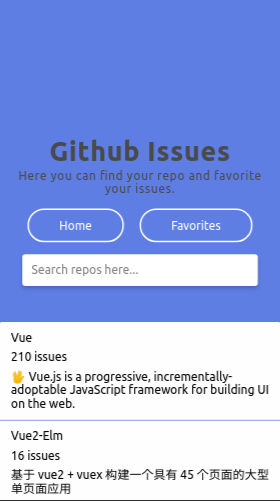
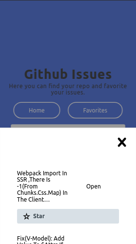
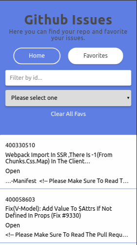

[](https://github.com/grighes/github-issues)
[](https://github.com/grighes/github-issues)

# Github Favorite Issues

> A front-end application using Vue.js to list GitHub issues and mark them as favorites.

## Desktop


## Mobile





## Project setup

```
yarn install
```

### Compiles and hot-reloads for development

```
yarn run serve
```

### Compiles and minifies for production

```
yarn run build
```

### Lints and fixes files

```
yarn run lint
```

### Run your unit tests

```
yarn run test:unit
```

## Github API

Innitially I was trying to get the closed issues from the issue state endpoint.
Then to each repositorie, call the api with the state endpoint to access the open and closed issues.

The problem was to make all requests without trigger the github rate limit:
"For unauthenticated requests, the rate limit allows you to make up to 10 requests per minute."
So, for practice purposes I choosed to use just the repositories endpoint:

```
GET /repos/:owner/:repo/issues
```

## Meta

Glauber Righes – [@grighes](https://twitter.com/grighes) – glauber.righes@gmail.com
